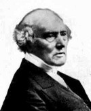

Room Squares
================
Matthew Henderson
May 27, 2018

-   [Introduction](#introduction)
    -   [Kirkman’s Schoolgirl Problem](#kirkmans-schoolgirl-problem)
    -   [Tournaments](#tournaments)
    -   [T.G. Room, (1902-86)](#t.g.-room-1902-86)
    -   [The Galois Field](#the-galois-field)
        -   [Example](#example)
-   [A graph-theoretic approach to constructing Room squares](#a-graph-theoretic-approach-to-constructing-room-squares)
-   [Proving the existence of Room squares](#proving-the-existence-of-room-squares)
-   [Balanced Room squares](#balanced-room-squares)
-   [Closing Remarks](#closing-remarks)

Introduction
============

Kirkman’s Schoolgirl Problem
----------------------------

In 1850 Thomas Penyngton Kirkman, an English mathematician from Bolton, published the following problem in the *Lady’s and Gentleman’s Diary.*

> *Fifteen young ladies of a school walk out three abreast for seven days in succession: it is required to arrange them daily so that no two shall walk abreast more than once*

In solving this problem Kirkman discovered the following square array, which he observed was a very "curious arrangement".

<table style="width:49%;">
<caption>Kirkman’s curious arrangement</caption>
<colgroup>
<col width="6%" />
<col width="6%" />
<col width="6%" />
<col width="6%" />
<col width="6%" />
<col width="6%" />
<col width="6%" />
</colgroup>
<tbody>
<tr class="odd">
<td></td>
<td></td>
<td></td>
<td>
hi
</td>
<td>
kl
</td>
<td>
mn
</td>
<td>
op
</td>
</tr>
<tr class="even">
<td></td>
<td>
il
</td>
<td>
mo
</td>
<td></td>
<td>
np
</td>
<td>
hk
</td>
<td></td>
</tr>
<tr class="odd">
<td></td>
<td>
no
</td>
<td>
hl
</td>
<td>
mp
</td>
<td></td>
<td></td>
<td>
ik
</td>
</tr>
<tr class="even">
<td>
lp
</td>
<td></td>
<td>
in
</td>
<td>
ko
</td>
<td>
hm
</td>
<td></td>
<td></td>
</tr>
<tr class="odd">
<td>
im
</td>
<td></td>
<td>
kp
</td>
<td></td>
<td></td>
<td>
lo
</td>
<td>
hn
</td>
</tr>
</tbody>
</table>

The curiosity of this square is that each of the letters h, i, k, l, m, n, o, p occurs precisely once in every column and row, while in the entire square each of the letters makes a pair with every other letter exactly once. Kirkman was able to employ this square to solve his Schoolgirl Problem. To each pair in the first column he added the element 1, to each pair in the second column 2 and so on. In addition he introduced the missing triple of numbers to each row. (e.g. row one has no elements in any of the first three columns so the numbers 1,2 and 3 would not appear hence he would add the triple 123). The seven rows of unique triples then corresponded to seven days in which the elements, corresponding to schoolgirls, were paired together exactly once throughout the arrangement. Thereby solving the problem.

<table style="width:53%;">
<caption>Kirkman's Schoolgirl's Solution</caption>
<colgroup>
<col width="11%" />
<col width="8%" />
<col width="8%" />
<col width="8%" />
<col width="8%" />
<col width="8%" />
</colgroup>
<tbody>
<tr class="odd">
<td align="center">Day 1</td>
<td align="center">123</td>
<td align="center">hi4</td>
<td align="center">kl5</td>
<td align="center">mn6</td>
<td align="center">op7</td>
</tr>
<tr class="even">
<td align="center">Day 2</td>
<td align="center">147</td>
<td align="center">il2</td>
<td align="center">mo3</td>
<td align="center">np5</td>
<td align="center">hk6</td>
</tr>
<tr class="odd">
<td align="center">Day 3</td>
<td align="center">156</td>
<td align="center">no2</td>
<td align="center">hl3</td>
<td align="center">mp4</td>
<td align="center">ik7</td>
</tr>
<tr class="even">
<td align="center">Day 4</td>
<td align="center">267</td>
<td align="center">lo2</td>
<td align="center">in3</td>
<td align="center">ko4</td>
<td align="center">hm5</td>
</tr>
<tr class="odd">
<td align="center">Day 5</td>
<td align="center">245</td>
<td align="center">io2</td>
<td align="center">kp3</td>
<td align="center">lo6</td>
<td align="center">hn7</td>
</tr>
<tr class="even">
<td align="center">Day 6</td>
<td align="center">357</td>
<td align="center">ho2</td>
<td align="center">km2</td>
<td align="center">ln4</td>
<td align="center">ip6</td>
</tr>
<tr class="odd">
<td align="center">Day 7</td>
<td align="center">346</td>
<td align="center">ko2</td>
<td align="center">hp2</td>
<td align="center">io5</td>
<td align="center">lm7</td>
</tr>
</tbody>
</table>

Kirkman was a notable mathematician who is often regarded as the originator of the object in Figure 2, which has subsequently become known as a Room square (after T.G. Room).

Tournaments
-----------

Suppose the English Football Association proposed hosting a new type of international tournament to be staged as a one-off event in England. This tournament would involve eight national sides competing in a league that would be staged in various stadia around the country over two weeks. The structure of the tournament would be such that every team played every other team once, with the winner being the team which accumulated most points in the manner of a normal football league (3 points for a win, 1 for a draw).

To know which matches need playing is simple. Suppose the eight invited teams are:

<table style="width:29%;">
<caption>Teams</caption>
<colgroup>
<col width="16%" />
<col width="12%" />
</colgroup>
<tbody>
<tr class="odd">
<td align="center">Argentina</td>
<td align="center">England</td>
</tr>
<tr class="even">
<td align="center">Brazil</td>
<td align="center">France</td>
</tr>
<tr class="odd">
<td align="center">Columbia</td>
<td align="center">Germany</td>
</tr>
<tr class="even">
<td align="center">Denmark</td>
<td align="center">Holland</td>
</tr>
</tbody>
</table>

If we write matches as alphabetic pairs in the obvious way, (e.g. ab denoting Argentina versus Brazil). The complete list of matches (the match set, M) is simply all unordered pairs from team set, T:
*T* = {*a*, *b*, *c*, *d*, *e*, *f*, *g*, *h*}.
 i.e.

*M* = {*a**b*, *a**c*, *a**d*, *a**e*, *a**f*, *a**g*, *a**h*, *b**c*, *b**d*, *b**e*, *b**f*, *b**g*, *b**h*, *c**d*, *c**e*, *c**f*, *c**g*, *c**h*, *d**e*, *d**f*, *d**g*, *d**h*, *e**f*, *e**g*, *e**h*, *f**g*, *f**h*, *g**h*}

It remains to be decided where and when the matches will be played.

The English F.A., for whatever reason (the financial cost of hosting eight teams, for example), has imposed a time limit of two weeks on the tournament. Realistically the treams can only manage to play on alternate days so it is decided to have, in effect, seven different "rounds" with each team competing once in each round. (Seven being the smallest number of rounds because each team has to play seven others).

For reasons of fairness the F.A. also demands the condition that each team will play once at each stadium. Can such a tournament exist? Suppose the stadia used are the following:

<table style="width:25%;">
<caption>Stadium</caption>
<colgroup>
<col width="25%" />
</colgroup>
<tbody>
<tr class="odd">
<td align="center">Wembley</td>
</tr>
<tr class="even">
<td align="center">Highbury</td>
</tr>
<tr class="odd">
<td align="center">Villa Park</td>
</tr>
<tr class="even">
<td align="center">Stadium of Light</td>
</tr>
<tr class="odd">
<td align="center">Stamford Bridge</td>
</tr>
<tr class="even">
<td align="center">Old Trafford</td>
</tr>
<tr class="odd">
<td align="center">St. James Park</td>
</tr>
</tbody>
</table>

Then figure 4 provides a match schedule which is suitable for such a tournament.

<table style="width:61%;">
<caption>Fixture List for an International Soccer League</caption>
<colgroup>
<col width="12%" />
<col width="6%" />
<col width="6%" />
<col width="6%" />
<col width="6%" />
<col width="6%" />
<col width="6%" />
<col width="6%" />
</colgroup>
<thead>
<tr class="header">
<th align="center"> </th>
<th align="center">1</th>
<th align="center">2</th>
<th align="center">3</th>
<th align="center">4</th>
<th align="center">5</th>
<th align="center">6</th>
<th align="center">7</th>
</tr>
</thead>
<tbody>
<tr class="odd">
<td align="center"><strong>1</strong></td>
<td align="center"></td>
<td align="center"></td>
<td align="center"></td>
<td align="center">ab</td>
<td align="center">cd</td>
<td align="center">ef</td>
<td align="center">gh</td>
</tr>
<tr class="even">
<td align="center"><strong>2</strong></td>
<td align="center"></td>
<td align="center">bd</td>
<td align="center">eg</td>
<td align="center"></td>
<td align="center">fh</td>
<td align="center">ah</td>
<td align="center"></td>
</tr>
<tr class="odd">
<td align="center"><strong>3</strong></td>
<td align="center"></td>
<td align="center">fg</td>
<td align="center">ad</td>
<td align="center">eh</td>
<td align="center"></td>
<td align="center"></td>
<td align="center">bc</td>
</tr>
<tr class="even">
<td align="center"><strong>4</strong></td>
<td align="center">dh</td>
<td align="center"></td>
<td align="center">bf</td>
<td align="center">cg</td>
<td align="center">ae</td>
<td align="center"></td>
<td align="center"></td>
</tr>
<tr class="odd">
<td align="center"><strong>5</strong></td>
<td align="center">be</td>
<td align="center"></td>
<td align="center">ch</td>
<td align="center"></td>
<td align="center"></td>
<td align="center">bg</td>
<td align="center">af</td>
</tr>
<tr class="even">
<td align="center"><strong>6</strong></td>
<td align="center">ag</td>
<td align="center">ce</td>
<td align="center"></td>
<td align="center">df</td>
<td align="center"></td>
<td align="center">bh</td>
<td align="center"></td>
</tr>
<tr class="odd">
<td align="center"><strong>7</strong></td>
<td align="center">cf</td>
<td align="center">ah</td>
<td align="center"></td>
<td align="center"></td>
<td align="center">bg</td>
<td align="center"></td>
<td align="center">de</td>
</tr>
</tbody>
</table>

Looking along the rows, each team plays once in each round. Looking down columns, each stadia hosts each team exactly once. And throughout the tournament as a whole each pair from the original match list appears exactly once, hence every team opposes every other team once. Figure 4 is another Room square of side 7. Alternatively, because the pairs are made from a set containing 8 elements, we say that this is a Room square of order 8.

T.G. Room, (1902-86)
--------------------

In 1955, Thomas Gerald Room, then Professor of Mathematics at the University of Sydney, published a brief note in the Mathematical Gazette entitled *A new type of magic square*.\[20\] In it he presented another example of a square array with the same properties as Kirkman’s. This square, Room explained, had been discovered as "a by-product of another investigation". It was preceded in the note by a particularly efficient statement of the properties of these squares, which have subsequently been known by his name.

> "The problem is to arrange the *n*(2*n* − 1) symbols *r**s* (which is the same as *s**r*) formed from all pairs of 2*n* digits such that in each row and each column there appear *n* symbols (and *n* − 1 blanks) which among them contain all 2*n* digits."

Room’s note went on to explain that while the trivial *n* = 1 Room square exists[1] , the non-existence of those with *n* = 2 (side 2) and *n* = 3 (side 5) is easily proven. Room considered the *n* = 2 proof so straightforward that it was omitted from this note, while for the *n* = 3 case he made reference to a graph-theoretic proof.

Consider the *n* = 2 case, we are required to place all the pairs of 4 digits in a 3x3 array. If we choose to use the set of non-negative integers {0, 1, 2, 3}, then we need to find somewhere to put each of the pairs {01, 02, 03, 12, 13, 23}. That we can swap the rows and columns of a Room square without damaging that square’s Room-ness is self-evident. Therefore there is no less of generality in assuming that a 3 × 3 Room square has the pair {0, 1} in cell (1, 1).

<table style="width:6%;">
<colgroup>
<col width="5%" />
</colgroup>
<tbody>
<tr class="odd">
<td align="center">01</td>
</tr>
</tbody>
</table>

If we hope to make this array a Room square we must place the pair {2, 3} in the first row, while to complete the first column we must also place the same pair in either position (1, 2) or (1, 3), but each pair is only allowed to appear once. So there is no Room square of side 3, order 4.

For the *n* = 3, a Room square of side 5, case we consider the following array:

<table style="width:32%;">
<colgroup>
<col width="6%" />
<col width="6%" />
<col width="6%" />
<col width="5%" />
<col width="5%" />
</colgroup>
<tbody>
<tr class="odd">
<td align="center">01</td>
<td align="center">23</td>
<td align="center">45</td>
<td align="center">-</td>
<td align="center">-</td>
</tr>
<tr class="even">
<td align="center">24</td>
<td align="center">-</td>
<td align="center">-</td>
<td align="center">-</td>
<td align="center">-</td>
</tr>
<tr class="odd">
<td align="center">35</td>
<td align="center">-</td>
<td align="center">-</td>
<td align="center">-</td>
<td align="center">-</td>
</tr>
</tbody>
</table>

There is no loss in generality in using this array because we can reorder rows and columns to obtain the first row in this form and then the first column must contain either the pairs {01, 24, 35} or {01, 25, 34} and the latter can be converted into the former by the permutation (45)[2] which leaves the first row unchanged. We now show that completion of this square is impossible. The pairs {2, 5},{3, 4} must appear somewhere in the array other than the first three rows or columns. Also they must appear in separate rows/columns to prevent a forced recurrence of {0, 1}. Suppose we put {2, 5} in (4, 4) and {3, 4} in (5, 5), then we know that cells (4, 5) and (5, 4) are empty, as the only pair which could legally go in either would be {0, 1}.

Hence we know that cells (4, 2),(4, 3),(5, 2),(5, 3) each contain pairs. Take cell (5, 2), it could only contain {0, 5} or {1, 5}, and the latter becomes the former under (01), so assume it contains {0, 5}. We are now forced to fill in the other cells to give the array in Figure 8.

<table style="width:35%;">
<colgroup>
<col width="6%" />
<col width="6%" />
<col width="6%" />
<col width="6%" />
<col width="6%" />
</colgroup>
<tbody>
<tr class="odd">
<td align="center">01</td>
<td align="center">23</td>
<td align="center">45</td>
<td align="center">-</td>
<td align="center">-</td>
</tr>
<tr class="even">
<td align="center">24</td>
<td align="center">-</td>
<td align="center">-</td>
<td align="center">-</td>
<td align="center">-</td>
</tr>
<tr class="odd">
<td align="center">35</td>
<td align="center">-</td>
<td align="center">-</td>
<td align="center">-</td>
<td align="center">-</td>
</tr>
<tr class="even">
<td align="center">-</td>
<td align="center">14</td>
<td align="center">03</td>
<td align="center">25</td>
<td align="center">-</td>
</tr>
<tr class="odd">
<td align="center">-</td>
<td align="center">05</td>
<td align="center">12</td>
<td align="center">-</td>
<td align="center">34</td>
</tr>
</tbody>
</table>

We still need to place the pairs {0, 2} and {0, 4}, which cannot be done because neither can appear in the second row and they cannot both appear in the third row. Hence there is no Room square of side 5, order 6.

The real significance of Room’s note was that mathematicians soon took on the task of determining the spectra of Room squares (those values of *n* for which Room squares exist). Research which cumulated 19 years later in the complete statement of the existence of Room squares, made by W.D. Wallis, that:

> *"Room squares exist for all odd positive integer sides except 3 and 5"* \[24\]

Proving this statement, which was suspected to be true from an early stage, turned out to be protracted and difficult.

The most significant breakthrough came in 1968 when Stanton and Mullin introduced the starter-adder method for constructing Room squares. This method reduces the problem of constructing Room squares to the problem of finding a certain type of initial row from which a Room square can be developed straightforwardly.

In this work much emphasis will be placed upon the proof of the existence of Room squares.

The Galois Field
----------------

Throughout this work much use will be made of a particular *finite field*, known as the Galois field, denoted by *G**F*(*p**n*). Whenever *p**n* is a prime (i.e. *n* = 1) the Galois field is precisely the integers under modulo p arithmetic, denoted *Z**p*. The Galois field has a number of important properties which are used in many of the proofs that follow, we introduce some of these now.

-   Every Galois field (every finite field in fact) has a *primitive element*. An element, *x* say, is primitive in *G**F*(*q*) if *x*0, *x*1, *x*2, ..., *x**q* − 1 are all the non-zero members of *G**F*(*q*).

### Example

*x* = 2 is a primitive element in *G**F*(11) because,
$$x^0 = 1 \\hspace{0.5cm} x^1 = 2 \\hspace{0.5cm} x^2 = 4 \\hspace{0.5cm} x^3 = 8 \\hspace{0.5cm} x^4 = 5$$
$$x^5 = 10 \\hspace{0.5cm} x^6 = 9 \\hspace{0.5cm} x^7 = 7 \\hspace{0.5cm} x^8 = 3 \\hspace{0.5cm} x^9 = 6$$

-   It can be shown \[3\] that *x**q* − 1 = 1 is always true for any *G**F*(*q*) where *q* is odd, and *x**i* ≠ 1 for any 1 ≤ *i* ≤ *q* − 1

-   *x**q* − 1 = 1 implies that $(x^{\\frac{1}{2}(q-1)}-1)(x^{\\frac{1}{2}(q-1)}+1)=0$, therefore either $x^{\\frac{1}{2}(q-1)}=1$ or $x^{\\frac{1}{2}(q-1)}=-1$. Clearly because of the previous remark, only the latter can be true.

-   If *b* is a non-zero residue modulo *p*, then *b* is a quadratic residue (or square) if *x*2 ≡ *b*(mod *p*) has solutions, otherwise *b* is a quadratic non-residue (or non-square). So the non-zero squares are precisely the even powers of the primitive element, while the non-zero non-squares are the odd powers.

-   There are precisely $\\frac{1}{2}(p-1)$ squares mod *p*, and $\\frac{1}{2}(p-1)$ non-squares.

-   −1 is a square if *q* ≡ 1(mod 4), but not a square for *q* ≡ 3(mod 4)

    -   *q* ≡ 1(mod 4), then if *x**i* is a square so is −*x**i*.

    -   *q* ≡ 3(mod 4), then *x**i* is a square −*x**i* is a non-square.

A graph-theoretic approach to constructing Room squares
=======================================================

Proving the existence of Room squares
=====================================

Balanced Room squares
=====================

Closing Remarks
===============

The results we have established in the previous chapter regarding the existence of balanced Room squares represent by no means the complete story. Du and Hwang \[10\] have established the existence of *S**S**B**S* for all prime powers
*q* = 2*α**t* + 1, *α* ≥ 2, *t* ≥ 3, *t*
 odd. Further, Anderson has shown that consequently the construction due originally to Hwang, Kang and Yu but corrected in \[2\], allows us to state the existence of the corresponding *B**R**S*(2*q* + 2) in one particular case.

By far the most significant remaining result which has not been included in the previous chapter is due to B.A. Anderson who proved that *B**R**S*(2*n*) exist for all odd *n* ≥ 3. His construction was based upon the theory of finite geometry, an area which has also contributed constructions for Room squares (the non-balanced kind). Other similar geometrical constructions have been used to establish the existence of *B**R**S*(2*n*), for 4 ≤ *n* ≤ 18, *n* even. The two smallest values of *n* ≡ 0(mod 4) for which the existence of a *B**R**S*(*n*) remains in doubt are 36 and 92. The first of these, along with many others, would be established by the doubling construction if a *S**S**B**S* could be found in *Z*17. This remains one of the most significant open problems for *B**R**S*, namely to establish the existence of *S**S**B**S* in *Z**n* when *n* is a Fermat prime.

The link between graph theory and Room squares that was touched upon in the second chapter has opened many avenues of research. Possibly the most interesting of which is the existence of perfect Room squares. A one-factorisation of *K**n* is said to be perfect if the union of two of its one-factors is a hamiltonian cycle of *K**n*. A perfect Room square is one of side *n* in which both row and column factorisations of *K**n* + 1 are perfect. Very little seems to be known about perfect one-factorisations. Individual examples of perfect Room squares of side 11 have been constructed but no infinite classes have yet been found.

[1] The Room squre of side1 is just the single array element containing the pair {0, 1}.

[2] This is cycle notation, and stands for the permutation 4 → 5, 5 → 4.
